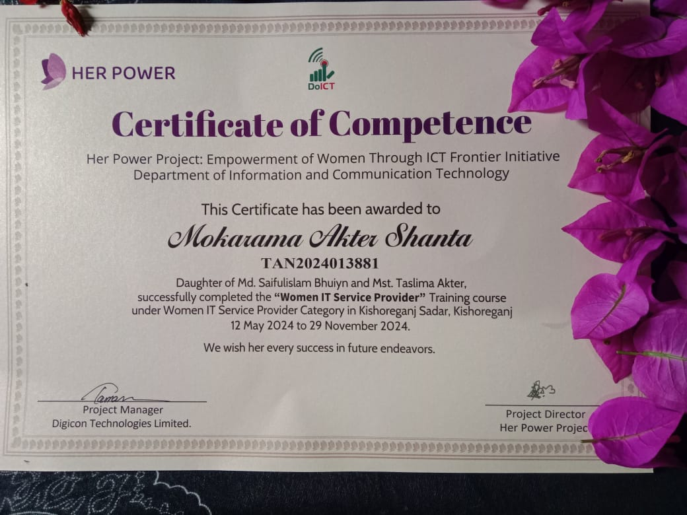

<!-- ======================= Banner ======================= -->

<p align="center">
  
</p>

<br>

<!-- ======================= Title ======================= -->

<div align="center">

# Hi 👋, I'm Mokarama Akter Shanta


</div>

---

<table>
<tr>

<td width="65%">

# 👩‍💻 About Me

- 👋 Hi, I'm **Mokarama Akter Shanta**

- 💻 I work with **React.js, Next.js, Node.js, Express.js, MongoDB, MySQL, and Tailwind CSS**

- 🚀 Currently learning **Backend Development, Modern Frontend Patterns, Authentication, REST APIs, and Scalable Web Applications**

- 🌱 Passionate about building clean, responsive and user-friendly web applications.

- 💬 Ask me about **React, Next.js, Express.js, MongoDB, Node.js**

- 🌐 Portfolio  
https://mokarama-akter-shanta-portfolio.vercel.app/

- 💼 LinkedIn  
https://www.linkedin.com/in/mokarama-akter-shanta

- 📫 Email  
mokaramaaktershanta@gmail.com

</td>

<td align="center">


</td>

</tr>
</table>

---

# 🌐 Follow Me

<p align="left">

<a href="https://www.linkedin.com/in/mokarama-akter-shanta">

</a>

<a href="mailto:mokaramaaktershanta@gmail.com">

</a>

<a href="https://github.com/YOUR_GITHUB_USERNAME">

</a>

<a href="https://mokarama-akter-shanta-portfolio.vercel.app/">

</a>

</p>

---

<p align="center">

</p>

---

# 🛠️ Technology Stack

## Languages

<p>


</p>

## Frontend

<p>


</p>

## Backend

<p>


</p>

## Database

<p>


</p>

## Deployment

<p>


</p>

## Tools

<p>


</p>

---
# 🏆 Certifications

<table>

<tr>

<td align="center">


### Complete Web Design Level-3

**NSDA**

</td>

<td align="center">



### IT Service Provider

**Her Power Project**

</td>

</tr>

<tr>

<td align="center">


### Express.js
**Simpli Learn**
****

</td>

<td align="center">


### React.js

**Simpli Learn**

</td>

</tr>

</table>

---


### Learning Management System

React • Express • MongoDB

</td>

</tr>

</table>


## 🔥 GitHub Streak

<p align="center">

</p>

---

## 💬 Random Dev Quote

<p align="center">


</p>

---

## ☕ Support Me

<p align="center">

If you like my work, consider giving a ⭐ to my repositories.

</p>

---

## 👀 Profile Views

<p align="center">


</p>

---

# 📂 Assets Folder Structure

```

YOUR_GITHUB_USERNAME/

│

├── README.md

│

└── assets/

├── banner.png

├── profile.png

├── coding.gif

├── certificate1.png

├── certificate2.png

├── certificate3.png

├── certificate4.png

├── project1.png

├── project2.png

├── project3.png

└── project4.png

```

---
---

<div align="center">

## ⭐ Thanks for Visiting My Profile!

### 💙 Happy Coding 

</div>
